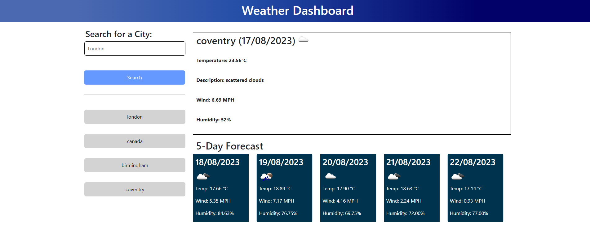

# Server APIs: Weather Dashboard


## Description

A Weather Dashboard application that uses the OpenWeatherMap API to fetch and display weather data for specific cities. The code covers functionalities like fetching current weather data, retrieving forecast data, converting temperature units, displaying weather icons, managing search history, and presenting the data on a user interface.

## Installation

. Clone the repository to your local machine.

. Open the project directory in your preferred console or code editor.
    
## Features

- Current Weather Display: The application fetches and displays current weather details for a specified city, including temperature, wind speed, humidity, and UV index.

- 5-Day Forecast: The application provides a 5-day forecast showing predicted weather conditions for upcoming days, including temperature, wind, and humidity.

- Temperature Unit Conversion: The code includes a function to convert temperature from Fahrenheit to Celsius, offering flexibility to users who prefer different units.

- Weather Icons: The application displays weather icons corresponding to the current weather conditions and the forecast days.

- Search History: The code allows users to search for weather information for different cities and keeps track of search history, enabling quick access to previously searched cities.


## Usage/Examples

Developers can use this code as a starting point to create their own Weather Dashboard applications. To use this code effectively, follow these steps:

>> Obtain an API key from OpenWeatherMap.

>> Set up an HTML structure for the user interface, including search input, search history, and areas to display current weather and forecast.

>> Include the necessary JavaScript code in your project, ensuring that you have the dayjs library imported.

>> Integrate the code into your application and test it thoroughly.

>> Customize the code and UI to match your design preferences and requirements.


## Screenshots




## Lessons Learned

During the development of this project, I learned the following:

**API Integration:** Learn how to make API requests using the Fetch API to retrieve weather data from external sources like OpenWeatherMap.

**DOM Manipulation:** Understand how to manipulate the Document Object Model (DOM) to dynamically create, modify, and remove elements on the user interface.

**Data Parsing:** Learn how to parse and extract data from JSON responses returned by API calls.

**Error Handling:** Gain insights into implementing basic error handling techniques, like checking response.ok, to handle API response errors gracefully.

**Date Manipulation:** Explore how to work with date and time using libraries like dayjs for formatting and manipulation.

**Search History and Local Storage:** Learn how to use local storage to store and retrieve data, such as search history, between different sessions.

**User Interface Design:** Observe how the user interface elements are structured and styled to provide a user-friendly experience.

**Code Organization:** Study how the code is organized into functions to manage different aspects of the application, enhancing code readability and maintainability.


## Credits

>> Stack Overflow: The Stack Overflow community provided solutions to specific coding challenges and troubleshooting help during the development process.

>> MDN Web Docs: The MDN Web Docs provided invaluable information about JavaScript, the DOM, and many other web development concepts.

 >>Thanks to the contributors of the JavaScript community for their valuable libraries and resources.


## Demo

Insert gif or link to demo


## Run Locally

Clone the project

```bash
  git clone https://link-to-project
```

Go to the project directory

```bash
  cd my-project
```

To open in visual studio

```bash
  code .
```


## License

Please refer to the LICENSE in the repo.

